# 🌌 Aether - v0 (Architecture & Concept)

> **⚠️ NOTA DE VERSIÓN:** Esta rama (`v0`) contiene exclusivamente documentación técnica, diagramas de arquitectura y especificaciones funcionales. **No contiene código fuente ejecutable.** Su propósito es establecer los cimientos lógicos del proyecto antes del desarrollo.

---

## 📋 Introducción a la Fase v0

El objetivo de esta fase es definir la **Lógica de Negocio** y la **Persistencia de Datos** de Aether. Antes de implementar microservicios en Spring Boot o interfaces en React, establecemos aquí las reglas del juego.

# 🗄️ Arquitectura de Datos (v2.0)

Para dar soporte a la complejidad requerida por los módulos de **Sistemas de Gestión Empresarial (SSG)** y **Acceso a Datos (AED)**, el modelo relacional de Aether se ha estructurado en **4 dominios lógicos**.

Esta normalización garantiza la integridad referencial, la escalabilidad del modelo de negocio (B2B/B2C) y una gestión robusta de la seguridad basada en roles (RBAC).

### 1. Dominio de Identidad y Seguridad (Auth)
*Gestión de acceso, roles y configuración de perfil.*

| Tabla | Tipo | Descripción Funcional |
| :--- | :--- | :--- |
| **`USUARIOS`** | **Maestra** | Entidad principal de identidad. Se mantiene ligera para optimizar la autenticación JWT. Incluye `password_hash` (BCrypt) y estado `activo` (para Soft Delete). |
| **`ROLES`** | **Catálogo** | Define los niveles de autoridad en la aplicación (ej: `ROLE_USER`, `ROLE_ADMIN`, `ROLE_B2B`). |
| **`USUARIOS_ROLES`** | **Pivote** | Tabla intermedia que resuelve la relación **N:M**. Permite que un usuario tenga múltiples roles simultáneamente (ej: Un Admin que también es Premium). |
| **`PREFERENCIAS`** | **Extensión** | Relación **1:1** con Usuarios. Almacena la configuración de UX (Modo Conductor, Tema Visual) separando la lógica de presentación de la identidad. |

### 2. Dominio de Negocio y Monetización (SSG)
*Soporte para la integración con ERP (Odoo) y gestión de suscripciones.*

| Tabla | Tipo | Descripción Funcional |
| :--- | :--- | :--- |
| **`PLANES`** | **Catálogo** | Define los productos comercializables (ej: *Free*, *Premium*, *Driver+*). Contiene el precio y las características del servicio. |
| **`SUSCRIPCIONES`** | **Transaccional** | Vincula a un usuario con un plan temporalmente. Almacena `id_referencia_pago` para cruzar datos con la facturación en **Odoo/Stripe**. |
| **`DESTACADOS_B2B`** | **Negocio** | Gestión de espacios publicitarios. Las emisoras pagan por aparecer aquí. Se sincroniza mediante Cron Jobs con las facturas pagadas en el ERP. |

### 3. Dominio Core: Radio y Contexto (App Logic)
*El corazón de la aplicación: Qué suena, dónde y cómo.*

| Tabla | Tipo | Descripción Funcional |
| :--- | :--- | :--- |
| **`EMISORAS`** | **Maestra** | Inventario de estaciones de radio. Identificadas por `UUID`. Almacena metadatos de streaming, logos y geolocalización (lat/lon). |
| **`HISTORIAL`** | **Big Data** | Registro inmutable de actividad. No solo guarda la emisora, sino el **contexto** (334    Clima, Mood) para alimentar futuros algoritmos de recomendación. |
| **`FAVORITOS`** | **Interacción** | Permite a los usuarios crear su biblioteca personal. Separada del historial para diferenciar "lo que escucho" de "lo que me gusta". |

### 4. Dominio de Metadatos (Taxonomía)
| Tabla | Tipo | Descripción Funcional |
| :--- | :--- | :--- |
| **`ETIQUETAS_MOOD`** | **Diccionario** | Base de conocimiento para el "Mood Tuner". Asocia palabras clave (ej: "Triste", "Gym") con géneros musicales. |

---

### 🗄️ Esquema de Base de Datos

```mermaid
erDiagram
    %% ---------------------------------------------------------
    %% BLOQUE 1: SEGURIDAD Y USUARIOS (Security Core)
    %% ---------------------------------------------------------
    USUARIOS ||--|{ USUARIOS_ROLES : "Tiene (N:M)"
    ROLES ||--|{ USUARIOS_ROLES : "Asignado a"
    USUARIOS ||--|| PREFERENCIAS_USUARIOS : "Configura (1:1)"

    USUARIOS {
        long id_usuario PK
        string nombre
        string email
        string password_hash
        datetime fecha_registro
        boolean activo
    }

    ROLES {
        int id_rol PK
        string nombre_rol "Ej: ROLE_USER, ROLE_ADMIN"
    }

    USUARIOS_ROLES {
        long id_usuario FK
        int id_rol FK
    }

    PREFERENCIAS_USUARIOS {
        long id_config PK
        long id_usuario FK
        boolean modo_conductor_auto
        enum tema_visual
        boolean ahorro_datos
    }

    %% ---------------------------------------------------------
    %% BLOQUE 2: NEGOCIO Y SUSCRIPCIONES (Business Logic - SSG)
    %% ---------------------------------------------------------
    PLANES ||--|{ SUSCRIPCIONES : "Define"
    USUARIOS ||--|{ SUSCRIPCIONES : "Contrata"
    EMISORAS ||--|{ DESTACADOS_B2B : "Promociona"

    PLANES {
        int id_plan PK
        string nombre "Free, Premium, Driver+"
        decimal precio_mensual
        string descripcion
    }

    SUSCRIPCIONES {
        long id_suscripcion PK
        long id_usuario FK
        int id_plan FK
        datetime fecha_inicio
        datetime fecha_fin
        boolean activa
        string id_referencia_pago "Transacción Odoo/Stripe"
    }

    DESTACADOS_B2B {
        long id_destacado PK
        uuid id_emisora FK
        datetime fecha_inicio_promo
        datetime fecha_fin_promo
        decimal precio_pagado
        boolean activo
    }

    %% ---------------------------------------------------------
    %% BLOQUE 3: CORE RADIO & INTERACCIÓN (App Logic)
    %% ---------------------------------------------------------
    USUARIOS ||--|{ HISTORIAL_CONTEXTUAL : "Genera"
    EMISORAS ||--|{ HISTORIAL_CONTEXTUAL : "Suena en"
    EMISORAS ||--|{ FAVORITOS : "Guardada en"
    USUARIOS ||--|{ FAVORITOS : "Guarda"

    EMISORAS {
        uuid id_emisora PK
        string nombre
        string url_stream
        string url_logo
        string genero_principal
        double latitud
        double longitud
        string pais
    }

    HISTORIAL_CONTEXTUAL {
        long id_historial PK
        long id_usuario FK
        uuid id_emisora FK
        datetime fecha_hora
        int duracion_seg
        string mood_input
    }

    FAVORITOS {
        long id_favorito PK
        long id_usuario FK
        uuid id_emisora FK
        datetime fecha_agregado
    }

    %% ---------------------------------------------------------
    %% BLOQUE 4: METADATA (Auxiliar)
    %% ---------------------------------------------------------
    ETIQUETAS_MOOD {
        int id_tag PK
        string palabra_clave
        string genero_asociado
    }
```

---

## 🛠️ Stack Tecnológico

Para la siguiente fase (v1 - Implementación), se ha aprobado el siguiente stack:

| Capa | Tecnología | Justificación |
| :--- | :--- | :--- |
| **Backend** | **Java (Spring Boot)** | Robustez, gestión de hilos y seguridad. |
| **Frontend** | **TypeScript (React)** | Componentización, ecosistema moderno y PWA. |
| **Base de Datos** | **MySQL / PostgreSQL** | Integridad relacional y soporte geoespacial. |
| **Despliegue** | **Docker** | Portabilidad y despliegue. |
| **Web** | **Angular** | Web para presentar el producto securizada con SSL. |
| **Gestión** | **Odoo** | Gestión de soporte y marketing. |
| **IA / NLP** | **Google Gemini API** | Procesamiento de lenguaje natural para el "Mood Tuner". |

---

## 🗺️ Roadmap de Desarrollo

* **v0 (Actual):** Definición de arquitectura, BBDD y Mockups UI.
* **v1 (Alpha):** "Hola Mundo" funcional. Login de usuarios y reproducción de una radio hardcodeada.
* **v2 (Beta):** Integración de API de Radios y Geolocalización básica.
* **v3 (Beta v2):** Integración de las funciones exceptuando IA.
* **v4 (Web):** Creación de los sitios web relaciones con la APP
* **v5 (Release Candidate):** Implementación del "Mood Tuner" (IA) y Modo Conductor.

---

## 👥 Equipo

* **@PRORIX** (Romén Gilberto García Gómez) - *Backend Lead & DB Architect*
* **@mahoramas** (Marcos Hernández Oramas) - *Frontend Lead & UX Specialist*

---
> *Documentación generada para el Proyecto Final de Ciclo (DAM).*
