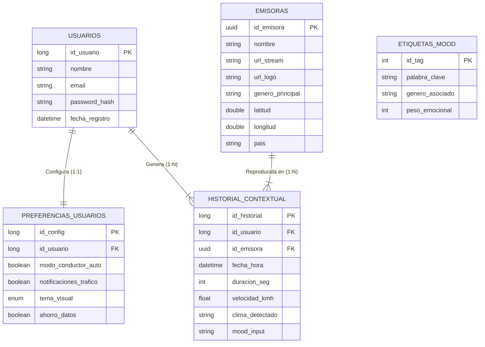

# 🌌 Aether - v0.0.1 (Architecture & Concept)

> **⚠️ NOTA DE VERSIÓN:** Esta rama (`v0`) contiene exclusivamente documentación técnica, diagramas de arquitectura y especificaciones funcionales. **No contiene código fuente ejecutable.** Su propósito es establecer los cimientos lógicos del proyecto antes del desarrollo.

---

## 📋 Introducción a la Fase v0

El objetivo de esta fase es definir la **Lógica de Negocio** y la **Persistencia de Datos** de Aether. Antes de implementar microservicios en Spring Boot o interfaces en React, establecemos aquí las reglas del juego.

## 💾 Arquitectura de Datos (Database Schema)

El núcleo de Aether reside en su base de datos relacional (SQL), diseñada para soportar consultas complejas de contexto y normalización estricta (cumpliendo requisitos de **AED**).

El sistema consta de **5 Tablas Maestras**:

### 1. `USUARIOS` (Core Identity)
Almacena la identidad digital. Se mantiene ligera para agilizar el proceso de Login/Auth.
* **PK:** `id_usuario` (UUID/Long)
* **Datos:** `email`, `password_hash`, `nombre`, `fecha_registro`.

### 2. `PREFERENCIAS_USUARIOS` (Configuration)
*Relación 1:1 con USUARIOS.*
Separa la configuración lógica de la identidad. Aquí residen los "switches" que activan la inteligencia de la app.
* **Datos Clave:**
    * `modo_conductor_auto` (Boolean): Activa la UI simplificada al detectar velocidad > 20km/h.
    * `tema_visual` (Enum): Controla el ahorro energético (OLED Black).

### 3. `EMISORAS_CACHE` (Content Catalog)
Actúa como un espejo local de la API externa (Radio Browser). Persistimos las emisoras para reducir latencia y permitir relaciones con el historial.
* **PK:** `id_emisora` (UUID externo).
* **Datos:** `url_stream`, `geo_lat`, `geo_lon`, `genero_principal`.

### 4. `HISTORIAL_CONTEXTUAL` (Big Data & AI Source)
*Relación 1:N con USUARIOS y EMISORAS.*
La tabla más crítica. No solo guarda "qué escuchó", sino el **contexto exacto** del momento.
* **Datos Clave:**
    * `velocidad_kmh`: Dato de sensor GPS/Acelerómetro.
    * `clima_snapshot`: Dato de API meteorológica (ej: "Lluvia").
    * `mood_input`: El texto o etiqueta que el usuario seleccionó.
    * `duracion_escucha`: Métrica de satisfacción (Engagement).

### 5. `ETIQUETAS_MOOD` (Semantic Dictionary)
Tabla auxiliar utilizada por el motor de búsqueda "Mood Tuner" para traducir sentimientos humanos a géneros musicales técnicos.
* **Ejemplo:** Input "Estoy triste" -> Busca etiqueta "Sad" -> Devuelve Géneros "Blues, Lo-Fi".

### 🗄️ Esquema de Base de Datos

---

## 🛠️ Stack Tecnológico Definido

Para la siguiente fase (v1 - Implementación), se ha aprobado el siguiente stack:

| Capa | Tecnología | Justificación |
| :--- | :--- | :--- |
| **Backend** | **Java (Spring Boot)** | Robustez, gestión de hilos (PGV) y seguridad. |
| **Frontend** | **TypeScript (React)** | Componentización, ecosistema moderno y PWA. |
| **Base de Datos** | **MySQL / PostgreSQL** | Integridad relacional y soporte geoespacial. |
| **Despliegue** | **Docker** | Portabilidad y despliegue (DPL). |
| **IA / NLP** | **Google Gemini API** | Procesamiento de lenguaje natural para el "Mood Tuner". |

---

## 🗺️ Roadmap de Desarrollo

* **v0 (Actual):** Definición de arquitectura, BBDD y Mockups UI.
* **v1 (Alpha):** "Hola Mundo" funcional. Login de usuarios y reproducción de una radio hardcodeada.
* **v2 (Beta):** Integración de API de Radios y Geolocalización básica.
* **v3 (Release Candidate):** Implementación del "Mood Tuner" (IA) y Modo Conductor.

---

## 👥 Equipo de Ingeniería

* **@PRORIX** (Romén Gilberto García Gómez) - *Backend Lead & DB Architect*
* **@mahoramas** (Marcos Hernández Oramas) - *Frontend Lead & UX Specialist*

---
> *Documentación generada para el Proyecto Final de Ciclo (DAM).*
