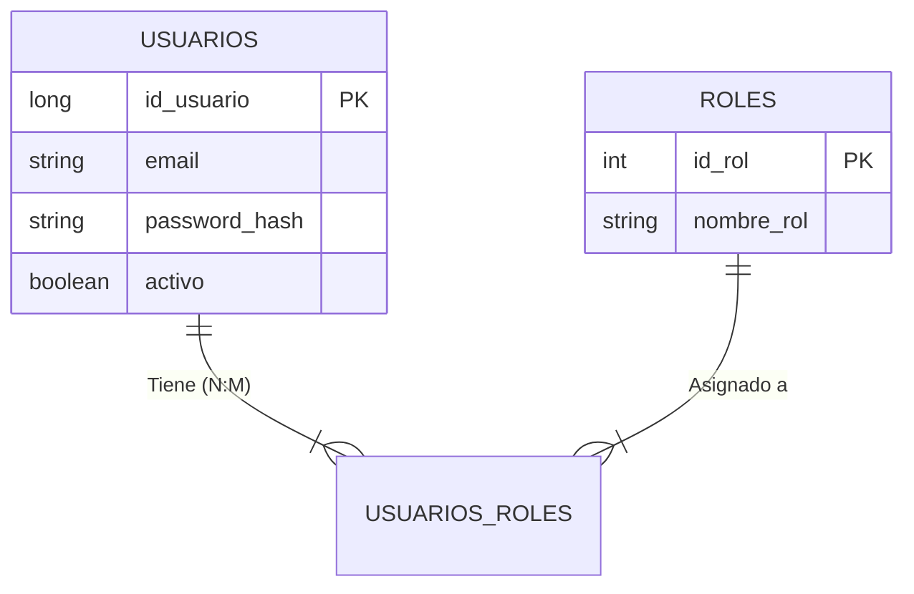

# Radio Aether 


## 🏗️ Arquitectura del Sistema (v1.0)

Para esta primera fase, hemos implementado una arquitectura monolítica modular optimizada para despliegue rápido y consistencia de datos (ACID).

### 📐 Modelo de Datos (ERD)

El núcleo de Aether se basa en un esquema relacional normalizado que soporta **Roles (RBAC)**, **Usuarios** y **Metadatos de Emisoras**.



---

## ✅ Funcionalidades Implementadas (v1 - Genesis)

Lo que ya funciona en el código actual:

### 🔐 1. Seguridad y Autenticación (Spring Security)

* **JWT (JSON Web Tokens):** Implementación de seguridad *Stateless*. El servidor no guarda sesiones, valida criptográficamente cada petición.
* **BCrypt Hashing:** Las contraseñas nunca se guardan en texto plano.
* **RBAC (Role-Based Access Control):** Sistema preparado para diferenciar entre `USER`, `ADMIN` y `B2B`.

### 📱 2. Cliente Móvil (React Native + Expo)

* **Reproducción de Audio:** Uso de `expo-av` para streaming de baja latencia.
* **Secure Storage:** Los tokens de sesión se guardan en el área encriptada del dispositivo (Keychain/Keystore), no en texto plano.
* **Interfaz Nativa:** Navegación fluida y componentes adaptados al SO.

### 💾 3. Persistencia Ligera (SQLite)

* Uso de **SQLite** como motor de base de datos embebido.
* *Justificación:* Garantiza la portabilidad total del proyecto sin necesidad de contenedores Docker externos en esta fase, alineándose con la filosofía *Edge Computing*.

---

## 🚀 Roadmap (Siguientes Pasos)

El desarrollo continúa hacia la **v2**. Estas son las funcionalidades planificadas:

* [ ] **Base de Datos Real de Emisoras:** Migrar del Mock actual a persistencia en BBDD.
* [ ] **Historial de Escucha:** Registrar qué escucha cada usuario.
* [ ] **API's:** Integración de API's necesarias para realizar las funciones.
* [ ] **Geolocalización:** Primeros pasos de geolocalización para recomnedar readios.

---

## 🛠️ Stack Tecnológico

| Capa | Tecnología | Descripción |
| --- | --- | --- |
| **Backend** | **Java 17 + Spring Boot 3** | API REST, Seguridad y Lógica de Negocio. |
| **Frontend** | **React Native + Expo** | Aplicación móvil híbrida (Android/iOS). |
| **Base de Datos** | **SQLite** | Persistencia relacional ligera y portable. |
| **Seguridad** | **Spring Security + JWT** | Protección de endpoints y cifrado. |
| **Comunicación** | **Axios** | Cliente HTTP con interceptores de seguridad. |

---

## ⚙️ Instrucciones de Ejecución

Sigue estos pasos para levantar el entorno de desarrollo local.

### 1. Backend (Servidor)

Necesitas **Java 17** y **Maven**.

```bash
cd RadioAether
# El comando siguiente descarga dependencias y arranca el servidor en puerto 8080
mvn spring-boot:run

```

*El servidor creará automáticamente el archivo `aether.db` y los usuarios iniciales.*

### 2. Frontend (Móvil)

Necesitas **Node.js** y la app **Expo Go** en tu móvil.

```bash
cd aether-mobile
# Instalar dependencias
npm install
# Arrancar el metro bundler
npx expo start

```

*Escanea el código QR con tu móvil (Android/iOS). Asegúrate de que el móvil y el PC están en la misma red WiFi.*

> **Nota:** Si usas un móvil físico, edita `src/api/axios.ts` y cambia `localhost` por la IP local de tu PC (ej: `192.168.1.X`).

---

## 👥 Autores

Este proyecto está siendo desarrollado con ❤️ y ☕ por:

* **Romén Gilberto García Gómez** - [@PRORIX](https://github.com/PRORIX)
* **Marcos Hernández Oramas** - [@mahoramas](https://github.com/mahoramas)

---

> *Proyecto Académico - IES Puerto de la Cruz - 2º DAM*
